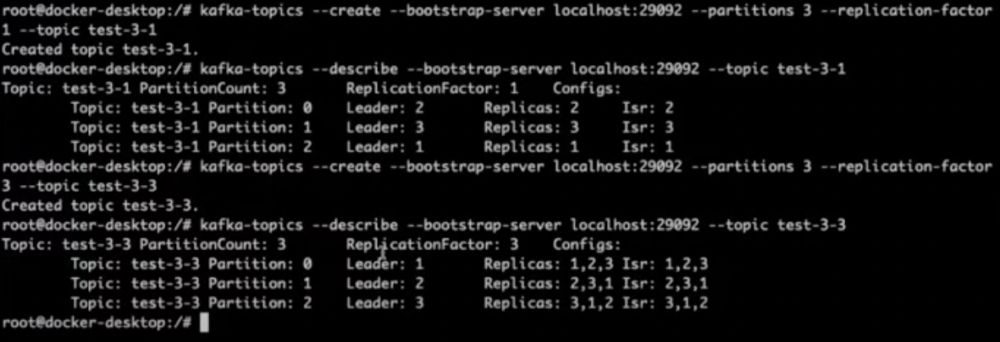
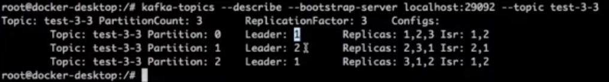

# Docker compose environments
Docker compose environments

#### Install Kafka (to run the commands below)
```sh
brew install kafka
```
OR
```sh
sudo apt-get install kafka
```

#### Create Topic
```sh
kafka-topics --bootstrap-server localhost:9092 --topic first_topic --create --partitions 3 --replication-factor 1
```

#### Create Message in Broker
```sh
kafka-console-producer --bootstrap-server localhost:9092 --topic first_topic
```

#### Listening Message in Broker
```sh
kafka-console-consumer --bootstrap-server localhost:9092 --topic first_topic --group firsttopic
```

#### Show info of all Topics
```sh
watch kafka-consumer-groups --all-groups --bootstrap-server localhost:9092 --all-topics -describe
```
#### Show all images docker compose
```sh
docker-compose ps
```

#### Insert input command in kafka cli inside docker
```sh
docker exec -it projects_kafka_1 bash
```
#### Inside the kafka instance (docker) type the command below to see all topics
```sh
kafka-topics.sh --list --bootstrap-server localhost:29092
```

#### Describe Topic
```sh
kafka-topics.sh --create --bootstrap-server localhost:29092 --partitions 3 --replication-factor 1 --topic test-3-1

kafka-topics.sh --describe --bootstrap-server localhost:29092 --partitions 3 --replication-factor 1 --topic test-3-1

kafka-topics.sh --create --bootstrap-server localhost:29092 --partitions 3 --replication-factor 3 --topic test-3-3

kafka-topics.sh --describe --bootstrap-server localhost:29092 --partitions 3 --replication-factor 3 --topic test-3-3
```
##### Example [Describe Topic]



### Kafka Cluster examples (kafka-cluster/docker-compose.yml)

#### Drop a kafka instance from the cluster (kafka-cluster/docker-compose.yml)
```sh
docker-compose stop kafka3
```
##### Example [Drop a kafka instance from the cluster]
